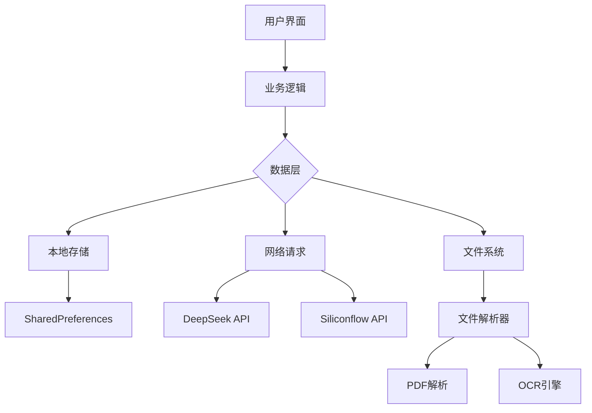

# DeepChat 🤖✨

[](https://flutter.dev)
[](https://opensource.org/licenses/MIT)
[](https://github.com/mikufoxxx/deepchat/pulls)

下一代智能聊天解决方案，融合深度文档分析能力

<p align="center">
  
  
</p>

## 🌟 核心功能

### 🧠 智能对话
| 功能                | 描述                          |
|---------------------|-----------------------------|
| 多平台API支持        | DeepSeek & Siliconflow 双引擎 |
| 流式响应            | 实时字符流输出，媲美ChatGPT体验 |
| 思考过程可视化       | 查看AI的完整推理链条           |

### 🛠 开发者友好
```bash
# 运行调试命令
flutter run 

# 构建发布版
flutter build apk --release
```
- 热重载支持
- 完善的日志系统
- 模块化架构设计

## 🚀 快速开始

### 系统要求
- Flutter 3.16.9+
- Dart 3.0+
- Android Studio / Xcode

### 安装步骤
1. 克隆仓库
```bash
git clone https://github.com/mikufoxxx/deepchat.git
cd deepchat
```

2. 安装依赖
```bash
flutter pub get
```

3. 配置环境
```bash
cp .env.example .env
# 在.env文件中填写API密钥
```

4. 运行应用
```bash
flutter run
```

## 🧩 技术架构



## 📜 开源协议

本项目采用 [MIT License](LICENSE)

---

**由狐狸ox打造** • [问题反馈](https://github.com/mikufoxxx/deepchat/issues)

<p align="center">
  <em>让对话更智能，让知识触手可及</em>
</p>
