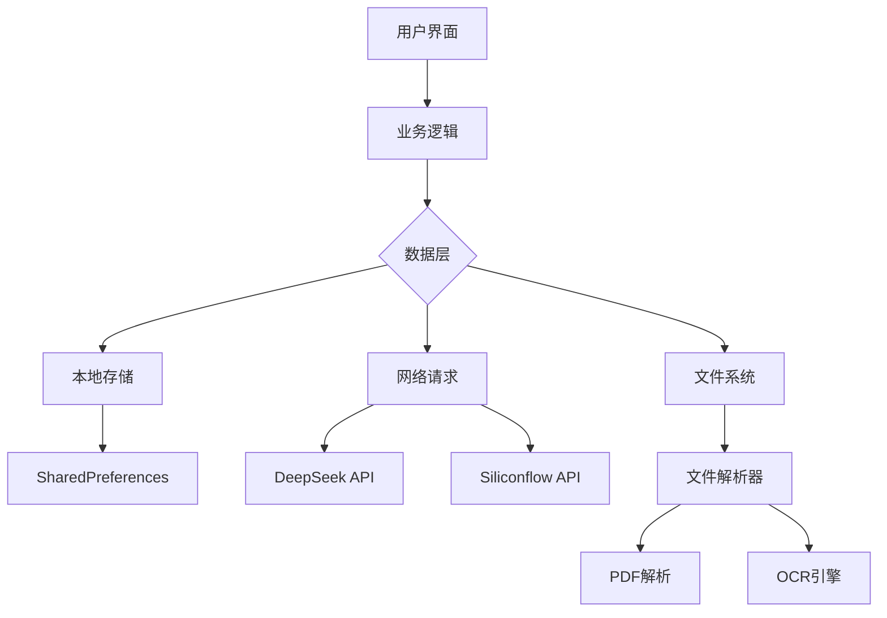

<think>
好的，用户希望更新README.md，添加文件上传和图片OCR功能，并且让介绍更详细、更酷，符合GitHub大项目的排版。我需要先回顾用户提供的代码库和现有README内容。

首先，用户之前的代码中提到了`file_picker`和`google_mlkit_text_recognition`的依赖，说明确实有文件上传和OCR功能。在`lib/services/storage_service.dart`中，有处理文档上下文和OCR文本的代码，这需要体现在README中。

接下来，用户希望详细介绍应用，并提升排版。GitHub上的大项目通常会有徽章、功能列表、安装指南、使用示例、技术栈、贡献指南等部分。现有的README结构已经不错，但需要更丰富的细节和视觉元素。

需要添加的功能点：
1. 文件上传支持多种格式（PDF、Word、TXT、图片）
2. 图片OCR文字识别
3. 文档内容分析
4. 多模态交互

排版方面，可以加入徽章（如版本、许可证、Flutter版本）、TOC目录，更结构化的功能描述，截图展示，代码块高亮，以及更详细的配置和使用说明。

还需要检查现有内容是否遗漏其他功能，比如温度调节、思考过程显示、多平台API支持，这些已经在之前的更新中提到，但可能需要更突出的展示。

最后，确保语言简洁有力，符合开源项目的专业风格，同时保持吸引力。可能需要分节更细致，比如功能、安装、配置、技术栈、贡献、许可证等，每部分都详细但不过于冗长。
</think>

# DeepChat 🤖✨

[](https://flutter.dev)
[](https://opensource.org/licenses/MIT)
[](https://github.com/mikufoxxx/deepchat/pulls)

下一代智能聊天解决方案，融合深度文档分析能力

<p align="center">
  
  
  
</p>

## 🌟 核心功能

### 🧠 智能对话
| 功能                | 描述                          |
|---------------------|-----------------------------|
| 多平台API支持        | DeepSeek & Siliconflow 双引擎 |
| 流式响应            | 实时字符流输出，媲美ChatGPT体验 |
| 思考过程可视化       | 查看AI的完整推理链条           |

### 🛠 开发者友好
```bash
# 运行调试命令
flutter run 

# 构建发布版
flutter build apk --release
```
- 热重载支持
- 完善的日志系统
- 模块化架构设计

## 🚀 快速开始

### 系统要求
- Flutter 3.16.9+
- Dart 3.0+
- Android Studio / Xcode

### 安装步骤
1. 克隆仓库
```bash
git clone https://github.com/mikufoxxx/deepchat.git
cd deepchat
```

2. 安装依赖
```bash
flutter pub get
```

3. 配置环境
```bash
cp .env.example .env
# 在.env文件中填写API密钥
```

4. 运行应用
```bash
flutter run
```

## 🧩 技术架构



## 📜 开源协议

本项目采用 [MIT License](LICENSE)

---

**由狐狸ox打造** • [问题反馈](https://github.com/mikufoxxx/deepchat/issues)

<p align="center">
  <em>让对话更智能，让知识触手可及</em>
</p>
